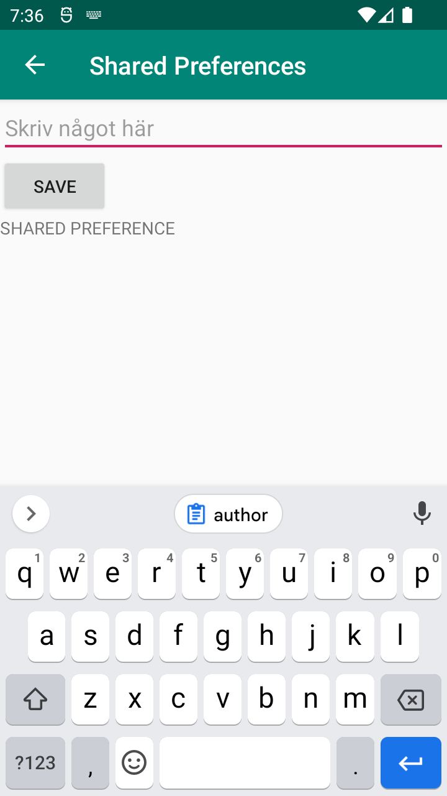
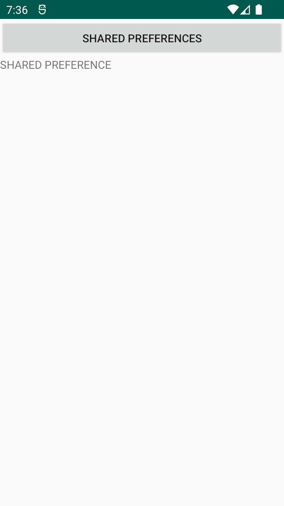

# Rapport
Skapat en ny aktivitet som kan öppnas genom en knapp i mainactivity. Det skapades genom en intent som byter sida. Efter det har det skapats en edittext på den andra aktiviteten som går att spara till en en shared preference variabel som sedan ska kunna användas i mainactivity. All koden förutom sparningsfunktionen från secondactivity skrivs också in i mainactivity för att kunna använda den delade texten.
```
//SecondActivity
protected void onCreate(Bundle savedInstanceState) {
        super.onCreate(savedInstanceState);
        setContentView(R.layout.activity_second);
        myPreferenceRef = getSharedPreferences("MyPreferenceName", MODE_PRIVATE);
        myPreferenceEditor = myPreferenceRef.edit();
        TextView prefTextRef=new TextView(this);
        prefTextRef=(TextView)findViewById(R.id.prefText);
        prefTextRef.setText(myPreferenceRef.getString("MyAppPreferenceString", "No preference found."));
    }
//MainActivity lägg märke till onResume().
@Override
    protected void onResume() {
        super.onResume();
        myPreferenceRef = getSharedPreferences("MyPreferenceName", MODE_PRIVATE);
        myPreferenceEditor = myPreferenceRef.edit();
        TextView prefTextRef=new TextView(this);
        Log.d("VVV", ""+myPreferenceRef.getString("MyAppPreferenceString", "No preference found."));
        prefTextRef=(TextView)findViewById(R.id.prefText);
        prefTextRef.setText(myPreferenceRef.getString("MyAppPreferenceString", "No preference found."));
    }
```

